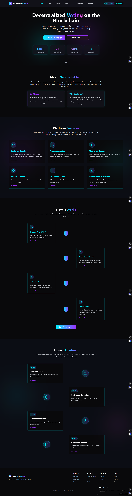

<h1 align='center'>Decenterlized Voting System</h1>

This just a basic projcet that uses hardhat with next js to implement proper responsive Voting app.
Nothing too fance just a basic one, proper candidate & voter register, with campign mangement.

---




---

### How to Start?

Check out artifacts in project folder, if missing run:

```
npx hardhat compile
```

Then copy `artifacts\contracts\VotingContract.sol\Create.json` and move inside `context\` i.e. context\Create.json

Deploye contract by:

```
npx hardhat run scripts/deploy.js --network sepolia
```

> You may need some balance in wallet as admin, paste private key in `hardhat.config.js`  `accounts[...]`

After deployment, copy deployed address of contract and paste in
`context\constants.js`

```
export const VotingAddress= '0x...'
```

Start next js project by:

```
npm run dev
```

